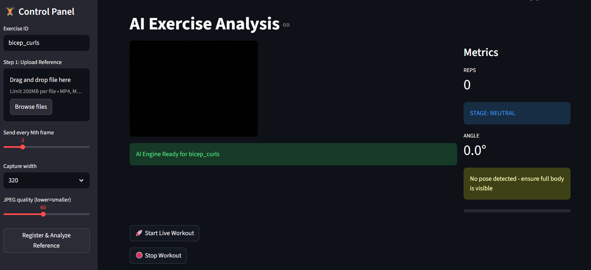

# 🏋️ AI Fitness Exercise Analysis System



## 🌟 Overview
Welcome to the **AI Fitness Exercise Analysis System**, a state-of-the-art solution designed for real-time exercise monitoring, pose detection, and automated rep counting. This project leverages advanced deep learning architectures to provide users with immediate feedback on their workouts, ensuring proper form and tracking progress with high precision.

## 🚀 Key Features
- **Real-time Pose Detection:** Utilizes MediaPipe for accurate 33-point human pose landmark tracking.
- **Advanced Classification:** Powered by a **Fine-tuned Bi-directional LSTM + Encoder** model for robust exercise recognition.
- **Smart Rep Counting:** Implements a multi-stage logic (SixPoint & Smart counters) to capture complete movement cycles.
- **Trajectory Tracking:** Visualizes and analyzes the path of movement for better biomechanical insights.
- **WebSocket Streaming:** Seamless real-time analysis with low-latency communication.
- **Interactive UI:** A sleek Streamlit-based frontend for effortless user interaction.

## 🧠 Model Architecture & Fine-tuning
The core of this system is a deep learning model that has been specifically **fine-tuned** on a comprehensive dataset of fitness movements. 
- **Architecture:** Bi-directional LSTM (Long Short-Term Memory) combined with a Transformer-based Encoder.
- **Input:** 66-feature vector (33 landmarks with X, Y coordinates).
- **Optimization:** Fine-tuned to recognize complex temporal patterns in exercises like bicep curls, squats, and more.

## 🛠️ Tech Stack
- **Backend:** FastAPI, Python
- **Frontend:** Streamlit
- **Computer Vision:** MediaPipe
- **Deep Learning:** TensorFlow, Keras
- **Communication:** WebSockets

## 📂 Project Structure
- `Main.py`: Backend entry point and model orchestration.
- `analysis_engine.py`: The heart of the real-time frame processing.
- `rep_counters.py`: Logic for different types of exercise repetition counting.
- `frontend.py`: Streamlit application for user interface.
- `trajectory.py`: Handles movement path tracking.
- `api_routes.py`: FastAPI endpoint definitions.

## 🔧 Installation & Setup

1. **Clone the repository**
   ```bash
   git clone https://github.com/YOUR_USERNAME/AI-Fitness-Project.git
   cd AI-Fitness-Project
   ```

2. **Create a virtual environment**
   ```bash
   python -m venv .venv
   source .venv/bin/activate  # On Windows: .venv\Scripts\activate
   ```

3. **Install dependencies**
   ```bash
   pip install -r requirements.txt
   ```

4. **Run the Application**
   - **Start Backend:**
     ```bash
     python Main.py
     ```
   - **Start Frontend:**
     ```bash
     streamlit run frontend.py
     ```

## 📈 Future Enhancements
- Integration of more complex exercises (e.g., HIIT, Yoga).
- Personalized form correction feedback using LLMs.
- Mobile application support.

---

